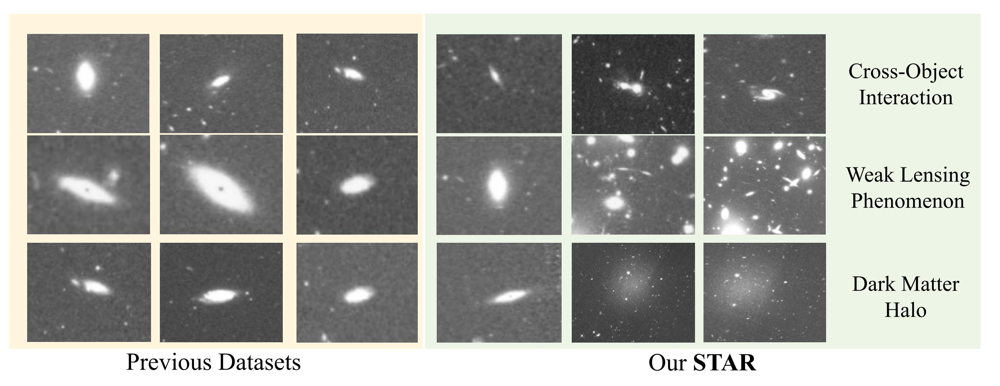

# STAR
This is the official codebase of the paper: **STAR: A Benchmark for Astronomical Star Fields Super-Resolution**

## License
The STAR dataset are erleased under MIT license.

## STAR datasets
We propose STAR, a large-scale astronomical SR dataset containing 54,738 flux-consistent star field image pairs covering wide celestial regions. These pairs combine Hubble Space Telescope high-resolution observations with physically faithful low-resolution counterparts generated through a flux-preserving data generation pipeline, enabling systematic development of field-level ASR models.

### Download
You can download the STAR dataset from this [text](https://huggingface.co/datasets/KUOCHENG/STAR) (Will be full complete...)

