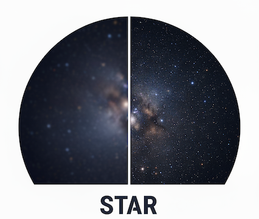

# STAR: A Benchmark for Astronomical Star Fields Super-Resolution

This is the official codebase for the paper:  
**STAR: A Benchmark for Astronomical Star Fields Super-Resolution**  
[ArXiv](https://arxiv.org/abs/2507.16385) | [Hugging Face Dataset](https://huggingface.co/datasets/KUOCHENG/STAR)



## License

This project is licensed under the [MIT License](LICENSE.md).

## Introduction

The **STAR (Super-Resolution for Astronomical Star Fields)** dataset is a large-scale benchmark for developing field-level super-resolution models in astronomy. It contains **54,738 flux-consistent image pairs** derived from Hubble Space Telescope (HST) high-resolution observations and physically faithful low-resolution counterparts. The dataset addresses three key challenges in astronomical super-resolution:

- **Flux Inconsistency**: Ensures consistent flux using a flux-preserving data generation pipeline.
- **Object-Crop Configuration**: Strategically samples patches across diverse celestial regions.
- **Data Diversity**: Covers dense star clusters, sparse galactic fields, and regions with varying background noise.

The dataset includes x2 and x4 scaling pairs in `.npy` format, suitable for training and evaluating super-resolution models.


## Dataset Structure

- **Full Data** (Hugging Face):
  - **x2 Dataset**: `data/x2/x2.tar.gz`
    - Folders: `train_hr_patch/` (HR training patches), `train_lr_patch/` (LR training patches), `eval_hr_patch/` (HR validation patches), `eval_lr_patch/` (LR validation patches), `dataload_filename/` (`.txt` files with HR/LR pair mappings).
  - **x4 Dataset**: `data/x4/x4.tar.gz`
    - Same structure as x2, for x4 scaling.
  - Download: [Hugging Face - KUOCHENG/STAR](https://huggingface.co/datasets/KUOCHENG/STAR)

- **Sample Data** (Hugging Face, for testing):
  - **x2 Sample**: `sampled_data/x2/`
    - Contains 500 HR/LR pairs in `train_hr_patch/` and `train_lr_patch/`, 100 pairs in `eval_hr_patch/` and `eval_lr_patch/` (total ~1200 `.npy` files).
   Quick Start:
   ```python
   from datasets import load_dataset
  import numpy as np
  dataset = load_dataset("KUOCHENG/STAR")
  sample = dataset['train'][0]
  hr_path = sample['hr_path']  # Path to HR .npy file
  lr_path = sample['lr_path']  # Path to LR .npy file
  
  hr_data = np.load(hr_path, allow_pickle=True).item()
  lr_data = np.load(lr_path, allow_pickle=True).item()
  ```
- **Source Data** (Optional):
  - Raw HST images used to generate patches.
  - Download: [Google Drive](https://drive.google.com/file/d/1SoNXzfoeY5x-mLJrMGv2pbrgm9bULzDU/view?usp=drive_link)

## Download

### 1. Full Dataset

Download the complete datasets for x2 and x4 scaling from Hugging Face:

- **x2**: `data/x2/x2.tar.gz` 
- **x4**: `data/x4/x4.tar.gz` 

**Usage**:

1. Download the `.tar.gz` file(s).

2. Extract to your project directory under `dataset/`:

   ```bash
   tar -xzf x2.tar.gz -C dataset/  # or x4.tar.gz
   ```

   The extracted structure will be (x2 for example):
   ```
   dataset/x2/
   ├── train_hr_patch/
   ├── train_lr_patch/
   ├── eval_hr_patch/
   ├── eval_lr_patch/
   ├── dataload_filename/
   │   ├── train_dataloader.txt
   │   ├── eval_dataloader.txt
   
   ```

### 2. Source Data

For raw HST images (pre-patched), download from:

- [Google Drive](https://drive.google.com/file/d/1SoNXzfoeY5x-mLJrMGv2pbrgm9bULzDU/view?usp=drive_link)

## Usage

### 1. Environment config

### 2. Training

### 3. Test

## Citation

If you use the STAR Dataset, please cite:
```bibtex
@article{wu2025star,
  title={STAR: A Benchmark for Astronomical Star Fields Super-Resolution},
  author={Wu, Kuo-Cheng and Zhuang, Guohang and Huang, Jinyang and Zhang, Xiang and Ouyang, Wanli and Lu, Yan},
  journal={arXiv preprint arXiv:2507.16385},
  year={2025},
  url={https://arxiv.org/abs/2507.16385}
}
```

## Contact

For issues or questions, open a GitHub issue or send me an email [12guocheng@gmail.com] for free.
